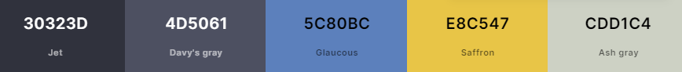

 Portfolio Client

Portfolio Client is a responsive web application built with Vite and React to showcase portfolio work.

The objective of this site is to provide an engaging and user-friendly interface to contact me.

The Deployed Site is available [HERE]()

## Table of Contents

- [Project Goals](#project-goals)
- [User Goals](#user-goals)
- [Agile Planning](#agile-planning)
- [Design](#design)
  - [Mockups](#mockups)
  - [Colour](#colour)
  - [Typography](#typography)
  - [Layout](#layout)
- [Features](#features)
- [Testing](#testing)
- [Technologies Used](#technologies-used)
- [Deployment](#deployment)
- [Credits](#credits)

## Project Goals

- Seamlessly manage and display portfolio items.
- Utilize a responsive design to ensure accessibility across devices.
- Interact with a clean and user-friendly interface.

## User Goals

- Quickly understand and navigate the platform.
- Easily add and manage portfolio items.

## Agile Planning

- Development followed an agile approach, with iterative cycles to ensure the application meets user needs.
- User stories and tasks were managed on a Kanban board.

## Design

### Mockups

    
Click to see Mockups

### Colour

The aim of the colour scheme is to provide a professional and calming user experience.

1. Jet (#30323D)
2. Davy's Gray (#4D5061)
3. Glaucous (#5C80BC)
4. Saffron (#E8C547)
5. Ash Gray (#CDD1C4)

  
Click to see Colour Palette

  

### Typography

The main typography used is `Montserrat`, chosen for its readability and clean aesthetics, and `DM Serif Display` for its more curved style.

### Layout

The layout aims to provide easy navigation and distinguish between different sections intuitively.

## Features

  
Click to view Features 

  <ul>
    <li>Responsive grid layout for portfolio items.</li>
    <li>Detailed view for each portfolio item.</li>
    <li>Add/Edit portfolio items functionality.</li>
    <li>Advanced filtering and search (future feature).</li>
    <li>Integration with social media (future feature).</li>
    <li>Analytics and visitor tracking (future feature).</li>
  </ul>

## Testing

### HTML Validation

### CSS Validation

### ESLint Validation

### Lighthouse Testing

### Manual Tests

  
Click to view Manual Tests

| Test Case # | Description                       | Steps                                             | Expected Result                                    | Actual Result |
|-------------|-----------------------------------|--------------------------------------------------|--------------------------------------------------|---------------|
| 1           | User Registration                 | 1. Navigate to "/register". 2. Fill out and submit the form. | User is registered and redirected to the login page. |          |
| 2           | User Login                        | 1. Navigate to "/login". 2. Enter credentials and submit. | User is logged in and redirected to the homepage. |          |
| 3           | Add Portfolio Item                | 1. Navigate to "/add". 2. Fill out and submit the form. | New item is added to the portfolio list.          |          |

### Unfixed Bugs

- Sometimes the portfolio grid does not update immediately after adding a new item. A potential solution is to implement real-time updates using websockets or a polling mechanism.

## Technologies Used

### Languages Used

- JavaScript
- CSS
- HTML

### Libraries and Frameworks Used

- React
- Vite
- React Router
- Axios
- Bootstrap
- React Redux

## Deployment

- Docker for containerized deployment.
- CI/CD pipeline setup for automated deployments.

## Credits

- Various code snippets and inspirations from open-source projects and tutorials.